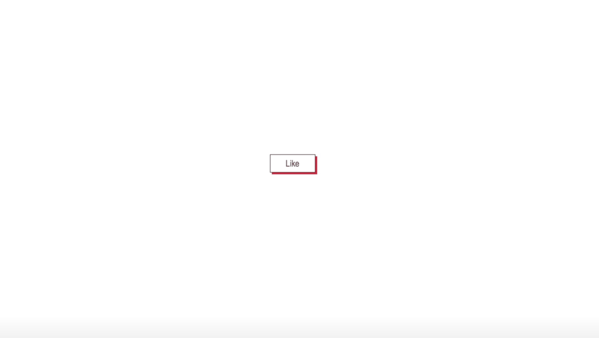

# :large_blue_circle: A canvas on Java Script and Yandex Lib

Press the button and start drawing. Press again to disable the canvas.

A study project at Practicum by Yande using its library for the canvas.

---

## :mag_right: Preview

---

## :link: Link to test

https://dianadomino24.github.io/like-button-canvas/

---

## :rocket: Technologies

-   **JavaScript ES6**

-   semantic **HTML5**

-   styles - **CSS3** including Flexbox.

---

**Practicum by Yandex** - https://practicum.yandex.com/

---

## :sparkles: Thanks for watching! :sparkles:
